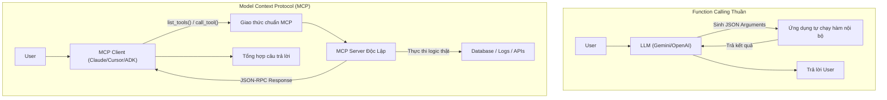
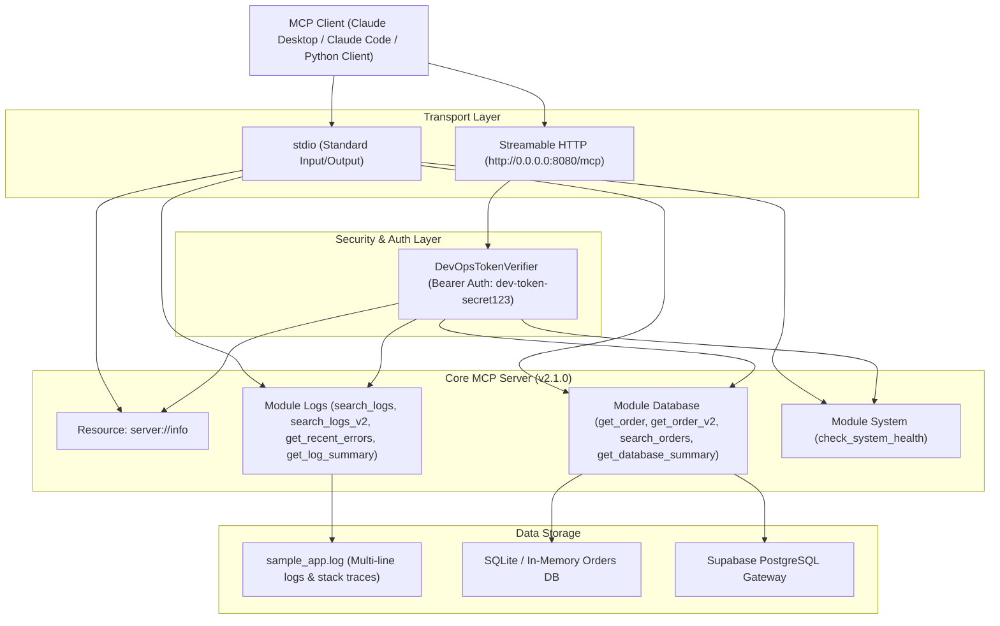

# BÁO CÁO KẾT QUẢ THỰC HÀNH LAB DAY 26: MCP TOOLS INTEGRATION
## Model Context Protocol (MCP) & Function Calling trong Hệ thống AI Thực Chiến

---

### 🎓 THÔNG TIN HỌC VIÊN & BÀI LÀM
- **Họ và tên:** Nguyễn Đức Nam Khánh
- **Mã học viên / MSSV:** 2A202601103
- **Khóa học:** AI Engineer Practical Training — Track 3 (Agents & Protocols)
- **Chủ đề:** Day 26 — MCP Tools Integration
- **Repository GitHub:** [https://github.com/NamKhanh2128/Day26-MCP-Tools-Integration-2A202601103-NguyenDucNamKhanh](https://github.com/NamKhanh2128/Day26-MCP-Tools-Integration-2A202601103-NguyenDucNamKhanh)
- **Thời gian hoàn thành:** 28/08/2026

---

## 📑 MỤC LỤC
1. [TỔNG QUAN VÀ MỤC TIÊU BÀI LAB](#1-tổng-quan-và-mục-tiêu-bài-lab)
2. [PHÂN BIỆT FUNCTION CALLING VÀ MODEL CONTEXT PROTOCOL (MCP)](#2-phân-biệt-function-calling-và-model-context-protocol-mcp)
3. [KIẾN TRÚC HỆ THỐNG VÀ USE CASE THỰC TẾ](#3-kiến-trúc-hệ-thống-và-use-case-thực-tế)
4. [CHI TIẾT TRIỂN KHAI THEO 3 CẤP ĐỘ BÀI TẬP](#4-chi-tiết-triển-khai-theo-3-cấp-độ-bài-tập)
   - [4.1. Bài 1 (Dễ): MCP Server cho công việc thực tế](#41-bài-1-dễ-mcp-server-cho-công-việc-thực-tế)
   - [4.2. Bài 2 (Trung bình): Streamable HTTP & Authentication](#42-bài-2-trung-bình-streamable-http--authentication)
   - [4.3. Bài 3 (Khó): Tool Versioning & Server Metadata](#43-bài-3-khó-tool-versioning--server-metadata)
   - [4.4. Tính năng Mở rộng & Bonus](#44-tính-năng-mở-rộng--bonus)
5. [KẾT QUẢ KIỂM THỬ TỰ ĐỘNG (AUTOMATED TEST SUITE)](#5-kết-quả-kiểm-thử-tự-động-automated-test-suite)
6. [HƯỚNG DẪN CÀI ĐẶT VÀ VẬN HÀNH](#6-hướng-dẫn-cài-đặt-và-vận-hành)
7. [KẾT LUẬN VÀ BÀI HỌC KINH NGHIỆM](#7-kết-luận-và-bài-học-kinh-nghiệm)

---

## 1. TỔNG QUAN VÀ MỤC TIÊU BÀI LAB

Trong kiến trúc ứng dụng AI hiện đại, việc kết nối mô hình ngôn ngữ lớn (LLM) với các hệ thống backend, cơ sở dữ liệu và công cụ nội bộ là yêu cầu sống còn. Bài thực hành **Day 26: MCP Tools Integration** giải quyết bài toán:
- Tách rời hoàn toàn logic công cụ (tools) khỏi ứng dụng client AI.
- Chuẩn hóa cơ chế khám phá (Tool Discovery), kết nối và thực thi công cụ qua giao thức chuẩn **Model Context Protocol (MCP)** do Anthropic khởi xướng.
- Tự động hóa một công việc thủ công hàng ngày của kỹ sư (DevOps Log Diagnostics & Database Intelligence) thành bộ MCP Tools hoàn chỉnh.
- Triển khai đầy đủ các tiêu chuẩn Production: Transport đa dạng (`stdio` và `Streamable HTTP`), Xác thực bảo mật Bearer Token (`TokenVerifier`), Quản lý vòng đời & Phiên bản công cụ (Versioning & Backward Compatibility), và Resource Metadata (`server://info`).

---

## 2. PHÂN BIỆT FUNCTION CALLING VÀ MODEL CONTEXT PROTOCOL (MCP)

### 2.1. Bản chất kỹ thuật



### 2.2. Bảng so sánh chi tiết

| Tiêu chí | Function Calling thuần (01-function-calling) | Model Context Protocol - MCP (02-mcp, my-mcp-server) |
|---|---|---|
| **Tầng kiến trúc** | Tầng Model Capability (Khả năng của LLM) | Tầng Giao thức Client-Server (Open Protocol) |
| **Nơi định nghĩa Tool** | Hard-code thủ công trong mã nguồn từng ứng dụng | Server tự công bố (Self-describing) qua `@mcp.tool()` |
| **Khám phá công cụ (Discovery)** | Phải nạp cố định vào prompt/config lúc khởi động | Khám phá động tại runtime qua `session.list_tools()` |
| **Tái sử dụng (Reusability)** | Kém, mỗi app/model phải viết lại schema | Viết 1 lần, mọi MCP Client (Claude, Cursor, VS Code) cắm vào dùng chung |
| **Transport** | Trong cùng process bộ nhớ | Đa dạng: `stdio` (cùng máy) hoặc `Streamable HTTP` (qua mạng LAN/Cloud) |
| **Bảo mật & Quản trị** | Phụ thuộc vào app bao ngoài | Tích hợp sẵn `TokenVerifier`, `AuthSettings`, Scopes |

---

## 3. KIẾN TRÚC HỆ THỐNG VÀ USE CASE THỰC TẾ

### 3.1. Bài toán nghiệp vụ được lựa chọn
- **Công việc thủ công hàng ngày của Kỹ sư / DevOps:**
  1. *Lục tìm log hệ thống:* Mở file `app.log`, dùng regex/grep tìm các exception `ERROR`, `CRITICAL`, giải mã stack trace, đếm tần suất lỗi và tìm nguyên nhân sự cố.
  2. *Tra cứu dữ liệu giao dịch & đơn hàng:* Mở database kiểm tra thông tin chi tiết đơn hàng, sản phẩm mua, trạng thái thanh toán và mã vận đơn.
  3. *Theo dõi tài nguyên máy chủ:* Kiểm tra CPU, RAM, Disk usage, process uptime và tính toàn vẹn của storage.

### 3.2. Sơ đồ kiến trúc giải pháp (`my-mcp-server`)



---

## 4. CHI TIẾT TRIỂN KHAI THEO 3 CẤP ĐỘ BÀI TẬP

### 4.1. Bài 1 (Dễ): MCP Server cho công việc thực tế
- **Triển khai:** Xây dựng package [`my-mcp-server`](file:///c:/Users/KHANH/Documents/GitHub/Day26-MCP-Tools-Integration-2A202601103-NguyenDucNamKhanh/my-mcp-server) độc lập với đầy đủ mô-đun hóa:
  * `tools/logs.py`: Hàm `search_logs(keyword, level, limit)` trích xuất log thực tế theo timestamp, severity level và nội dung.
  * `tools/database.py`: Hàm `get_order(order_id)` và `search_orders(status, min_amount, limit)` tra cứu dữ liệu đơn hàng itemized.
  * `tools/system.py`: Hàm `check_system_health()` kiểm tra CPU, Memory, Disk và tiến trình.
- **Tích hợp stdio:** Hỗ trợ kết nối chuẩn `stdio` với Claude Code (`claude mcp add`) và Claude Desktop (`claude_desktop_config.json`).
- **Khắc phục lỗi Windows Stdio:** Bổ sung cờ `-u` (Unbuffered I/O) và `PYTHONUNBUFFERED=1` để truyền dữ liệu JSON-RPC tức thời không bị block bởi buffer OS.

### 4.2. Bài 2 (Trung bình): Streamable HTTP & Authentication
- **Chuyển đổi Transport:** Hỗ trợ tham số `--transport streamable-http --port 8080` (hoặc `PORT` env var).
- **Cơ chế Xác thực (TokenVerifier):**
  ```python
  class DevOpsTokenVerifier(TokenVerifier):
      async def verify_token(self, token: str) -> AccessToken | None:
          token_data = VALID_TOKENS.get(token)
          if token_data is None:
              return None
          return AccessToken(
              token=token,
              client_id=str(token_data["client_id"]),
              scopes=list(token_data["scopes"]),
          )
  ```
- **Kiểm thử tự động 3 kịch bản:**
  1. *Token hợp lệ (`dev-token-secret123`):* Server phản hồi HTTP 200 OK, cấp quyền truy cập 9 công cụ và thực thi lệnh thành công.
  2. *Token sai (`wrong_secret_token`):* Server từ chối yêu cầu và ngắt kết nối an toàn (HTTP 401/403).
  3. *Không có token (Thiếu Header Authorization):* Server từ chối ngay tại tầng transport (HTTP 401).

### 4.3. Bài 3 (Khó): Tool Versioning & Server Metadata
- **Chiến lược Versioning (Backward Compatibility):**
  * Duy trì song song công cụ `search_logs` (v1: chuỗi text) và `search_logs_v2` (v2: cấu hình JSON giàu dữ liệu với phát hiện bất thường Anomaly Detection và gợi ý giải pháp).
  * Duy trì song song `get_order` (v1) và `get_order_v2` (v2: itemized line items, tracking number, customer details).
- **Resource `server://info`:**
  * Công bố metadata máy chủ, phiên bản protocol `MCP/2024-11-05`, danh mục công cụ, trạng thái deprecated và hướng dẫn di chuyển (migration guide).
- **Smart Client (`client_smart.py`):**
  * Tự động đọc `server://info` trước khi gọi tool.
  * Nếu phát hiện tool v2 khả dụng -> tự động gọi v2. Nếu máy chủ cũ chỉ có v1 -> tự động fallback về v1 mà không làm gián đoạn người dùng.

### 4.4. Tính năng Mở rộng & Bonus
- **Data Engine Linh Hoạt:** Cơ chế Hybrid Gateway tự động khởi tạo và seed dữ liệu vào SQLite khi offline và hỗ trợ PostgreSQL (Supabase) khi online.
- **An toàn Thông tin (Security First):** Toàn bộ secrets/tokens được quản lý qua `.env` (đã nằm trong `.gitignore`), cung cấp template [`.env.example`](file:///c:/Users/KHANH/Documents/GitHub/Day26-MCP-Tools-Integration-2A202601103-NguyenDucNamKhanh/my-mcp-server/.env.example) an toàn cho cộng tác nhóm.
- **Bảo toàn Tương thích Ngược cho Lab 04:** Tinh chỉnh `04-lab/mcp-server/weather.py` tương thích song song cả `mcp 1.x` (`FastMCP`) và `mcp 2.x` (`MCPServer`).

---

## 5. KẾT QUẢ KIỂM THỬ TỰ ĐỘNG (AUTOMATED TEST SUITE)

Bộ kiểm thử được thực thi tự động qua file [`run_all_tests.py`](file:///c:/Users/KHANH/Documents/GitHub/Day26-MCP-Tools-Integration-2A202601103-NguyenDucNamKhanh/my-mcp-server/run_all_tests.py):

```bash
$env:PYTHONUTF8="1"; python my-mcp-server/run_all_tests.py
```

### Bảng tổng hợp kết quả:

| Nhóm Kiểm thử | Số lượng Test Cases | Trạng thái | Ghi chú |
|---|---|---|---|
| **Unit Tests: Log Analytics** | 4 tests | ✅ PASSED | `search_logs`, `search_logs_v2`, `get_recent_errors`, `get_log_summary` |
| **Unit Tests: Database Tools** | 4 tests | ✅ PASSED | `get_order`, `get_order_v2`, `search_orders`, `get_database_summary` |
| **Unit Tests: System Telemetry** | 1 test | ✅ PASSED | `check_system_health` |
| **Unit Tests: Authentication Provider** | 4 tests | ✅ PASSED | Default token, Prod token, Invalid token, Empty token |
| **Unit Tests: Versioning & Resource** | 2 tests | ✅ PASSED | `server_info` schema, Deprecation mappings |
| **Integration: Stdio Transport** | End-to-End | ✅ PASSED | Khám phá 9 tools & gọi thực thi thành công |
| **Integration: Smart Client Discovery** | End-to-End | ✅ PASSED | Đọc `server://info`, tự động đàm phán v2/v1 |
| **Integration: Streamable HTTP Auth** | 3 Scenarios | ✅ PASSED | Valid Token (200 OK), Invalid Token (Blocked), Missing Token (Blocked) |

```text
======================================================================
📋 COMPREHENSIVE TEST RESULTS REPORT
======================================================================
  1. Unit Tests (Tools, Auth, Versioning) : ✅ PASSED (15/15 tests)
  2. Stdio Client End-to-End Test         : ✅ PASSED
  3. Smart Client (server://info discovery): ✅ PASSED
  4. Streamable HTTP + Auth (3 Scenarios) : ✅ PASSED
  Total Duration: 15.64s
======================================================================
🎉 ALL TEST SUITES PASSED WITH 100% SUCCESS!
```

---

## 6. HƯỚNG DẪN CÀI ĐẶT VÀ VẬN HÀNH

### 6.1. Cài đặt môi trường
```bash
# Tạo môi trường ảo
python -m venv .venv

# Kích hoạt môi trường (Windows PowerShell)
.venv\Scripts\Activate.ps1

# Cài đặt thư viện phụ thuộc
pip install -r requirements.txt
```

### 6.2. Chạy Server
- **Chế độ stdio (Dùng cho Claude Code / Claude Desktop):**
  ```bash
  python my-mcp-server/server.py --transport stdio
  ```
- **Chế độ Streamable HTTP (Dùng cho Web / Microservices):**
  ```bash
  python my-mcp-server/server.py --transport streamable-http --port 8080
  ```

### 6.3. Cấu hình cho Claude Desktop
Thêm vào file cấu hình `%APPDATA%\Claude\claude_desktop_config.json`:
```json
{
  "mcpServers": {
    "devops-intelligence": {
      "command": "C:\\Users\\KHANH\\miniconda3\\python.exe",
      "args": [
        "-u",
        "c:\\Users\\KHANH\\Documents\\GitHub\\Day26-MCP-Tools-Integration-2A202601103-NguyenDucNamKhanh\\my-mcp-server\\server.py"
      ],
      "env": {
        "PYTHONUTF8": "1",
        "PYTHONUNBUFFERED": "1",
        "PYTHONPATH": "c:\\Users\\KHANH\\Documents\\GitHub\\Day26-MCP-Tools-Integration-2A202601103-NguyenDucNamKhanh\\my-mcp-server",
        "MCP_AUTH_TOKEN": "dev-token-secret123"
      }
    }
  }
}
```

---

## 7. KẾT LUẬN VÀ BÀI HỌC KINH NGHIỆM

1. **Hiểu sâu giao thức MCP:** MCP không thay thế Function Calling mà là lớp giao thức chuẩn hóa (standard protocol) giúp mở khóa khả năng tích hợp linh hoạt, cắm-và-chạy (plug-and-play) của mọi client AI với các hệ thống dữ liệu.
2. **Kinh nghiệm thực chiến Production:**
   - Khi chạy `stdio` trên Windows, luôn cần lưu ý cơ chế buffer của Python (`-u` và `PYTHONUNBUFFERED=1`) để tránh nghẽn luồng JSON-RPC.
   - Khi nâng cấp tính năng cho tool, nguyên tắc **Backward Compatibility** là bất khả xâm phạm: không sửa/xóa field cũ mà tạo version mới song song hoặc sử dụng default parameter.
   - Việc công bố metadata qua Resource `server://info` giúp client AI trở nên thông minh hơn khi tự động phát hiện năng lực của server và chọn phương thức tương tác tối ưu.

---
*Báo cáo được biên soạn và kiểm thử hoàn tất bởi học viên Nguyễn Đức Nam Khánh (2A202601103).*
